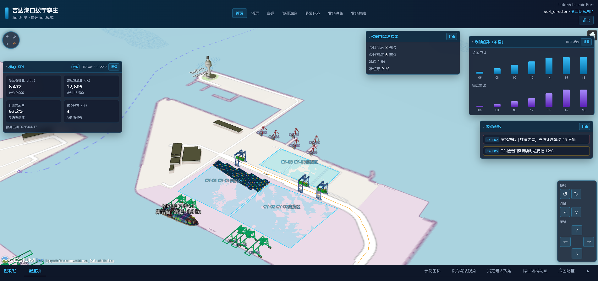
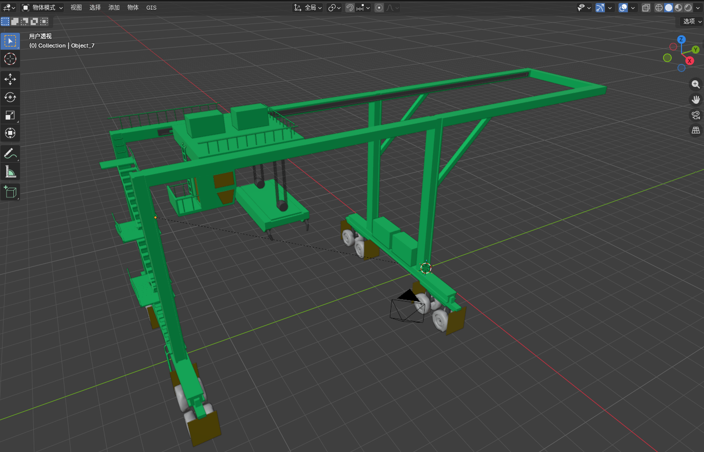

# 吉达港口数字孪生 · 演示工程

基于《演示版技术实现文档》的最小可运行 PoC：**React + Vite + CesiumJS** 大屏，**Express** 提供模拟 REST 与 WebSocket。




## 前置要求

- Node.js 18+
- npm 10+

## 启动

**终端 1 — 后端（端口 3001）**

```bash
cd backend
npm install
npm run dev
```

**终端 2 — 前端（端口 5173）**

```bash
cd frontend
npm install
npm run dev
```

浏览器打开：<http://localhost:5173>

## Cesium 地形与影像（文档 §6.1 / 方案 B）

- 默认使用 **Cesium World Terrain + OpenStreetMap 街道底图**；全球地形仍通过 Ion（内置评估 Token 或 `.env` 自配 Key）。
- 初始视角为 **斜视吉达灯塔**（约 45° 俯角），可自由操作地图；点 Cesium **主页**按钮可回到该视角。
- 左侧可切换 **椭球 / World Terrain**（有无高差），便于离线或调试。
- 在 `frontend/.env` 中可填写 `VITE_CESIUM_ION_TOKEN`（Ion 额度与商用）。底图为 OpenStreetMap 默认街道瓦片。

## 认证与角色（SQLite）

后端首次启动会在 `backend/data/port.db` 创建 **SQLite** 数据库，并写入角色与演示账户（密码已哈希存储）。

| 角色 | 用户名 | 密码 |
|------|--------|------|
| 港口运营总监 | `port_director` | `PortDir@2026` |
| 货运调度员 | `freight_dispatcher` | `FreightDisp@2026` |
| 客运调度员 | `passenger_dispatcher` | `PassengerDisp@2026` |
| 设备运维工程师 | `ops_engineer` | `OpsEng@2026` |

- **港口运营总监** 顶部导航：首页、货运、客运、资源统筹、异常响应、业务决策、业务总结（首页为数字孪生主屏）。
- **货运调度员** 顶部导航：业务准备、船舶靠泊调度、货物装卸调度、堆场管理调度、车辆转运调度、业务异常处理、船舶离泊调度、业务复盘（**业务准备**为数字孪生主屏：Cesium + 当日货运准备 KPI 浮动面板；其余为与运营总监风格一致的调度子页，数据来自 `/api/freight/*`）。
- **客运调度员** 顶部导航：首页、客轮调度准备、客流疏导调度、旅客检票调度、客轮登船调度、业务异常处理、客运服务管控、业务复盘（首页为数字孪生主屏：Cesium + 客运业务计划浮动面板）。
- **设备运维工程师** 顶部导航：首页、设备日常巡检、故障响应处理、设备维护保养、业务协同配合、设备状态更新、运维复盘（首页为数字孪生主屏：Cesium + 运维计划浮动面板；子页支持布局编排与保存）。

生产环境请设置环境变量 `JWT_SECRET`。登录接口返回 JWT，前端保存在 `localStorage` 中。

## 接口说明

| 路径 | 说明 |
|------|------|
| `GET /api/health` | 健康检查 |
| `POST /api/auth/login` | 登录，`{ username, password }`，返回 `token`、`user`、`navItems` |
| `GET /api/auth/me` | 校验 `Authorization: Bearer <token>`，返回当前用户与 `navItems` |
| `GET /api/layout/:pageKey` | 读取当前用户的页面布局配置（SQLite 持久化，缺省返回默认布局） |
| `PUT /api/layout/:pageKey` | 保存当前用户的页面布局配置（请求体：`{ layout }`） |
| `GET /api/stats` | 大屏 KPI（模拟） |
| `GET /api/ships` | 船舶列表（模拟） |
| `GET /api/alerts` | 告警列表（模拟） |
| `GET /api/director/overview`等 | 港口运营总监子页演示数据（`/freight` `/passenger` `/resources` `/exceptions` `/decisions` `/summary`） |
| `GET /api/freight/overview` 等 | 货运调度员子页演示数据（`/berthing` `/handling` `/yard` `/vehicle` `/exceptions` `/departure` `/review`） |
| `WS /ws` | 约每 3 秒推送 `ship_update` / `stats_update` / `director_overview_update` |

开发模式下 `/api` 与 `/ws` 由 Vite 代理到后端。

## 构建前端

```bash
cd frontend
npm run build
```

静态资源在 `frontend/dist`，需由 Web 服务器托管，并将 `/api`、`/ws` 反向代理到后端。
